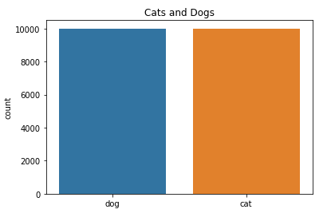
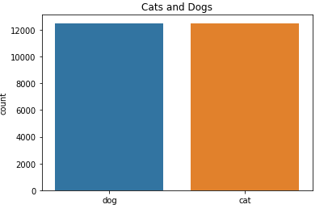
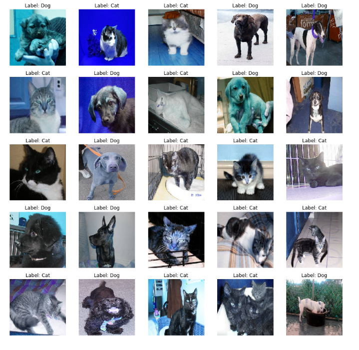
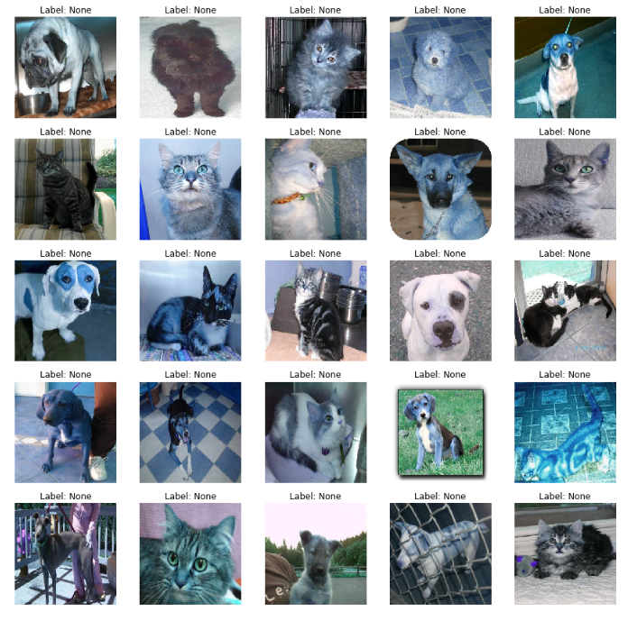
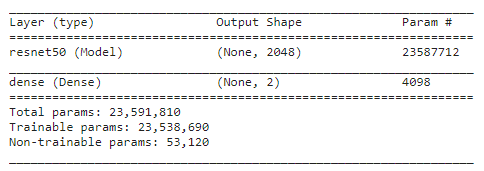

# Cats or Dogs - using CNN with Transfer Learning

<center></img></center>

## 원본 글 주소
[캐글 원본 글 바로가기](https://www.kaggle.com/code/gpreda/cats-or-dogs-using-cnn-with-transfer-learning)

## Introduction

### Dataset

The **train** folder contains **25,000** images of **dogs** and **cats**. Each image in this folder has the label as part of the filename. The **test** folder contains **12,500** images, named according to a numeric id.  
For each image in the test set, you should predict a probability that the image is a dog (**1** = **dog**, **0** = **cat**).

**train** 폴더에는 **25,000**개의 **개**와 **고양이** 이미지가 있다. 이 폴더 내 각각의 이미지는 파일 이름의 일부에 라벨을 포함하고 있다. **test** 폴더는 숫자 ID에 따라 이름이 지정된 **12,500**개의 이미지가 포함되어 있다.
테스트 세트 내 각각의 이미지에 대해 이미지가 개일 확률을 예측해야 한다(**1** = **개**, **0** = **고양이**).


### Method

For the solution of this problem we will use a pre-trained model, **ResNet-50**, replacing only the last layer.

이를 위해 사전에 학습된 모델인 **ResNet-50**을 사용하고, 마지막 레이어만 교체한다.

## Load packages
``` python
import os, cv2, random
import numpy as np
import pandas as pd
import seaborn as sns
import matplotlib.pyplot as plt
from sklearn.model_selection import train_test_split
from sklearn.metrics import classification_report
from tqdm import tqdm
from random import shuffle 
from IPython.display import SVG
from keras.utils.vis_utils import model_to_dot
from keras.utils import plot_model
from tensorflow.python.keras.applications import ResNet50
from tensorflow.python.keras.models import Sequential
from tensorflow.python.keras.layers import Dense, Flatten, GlobalAveragePooling2D
%matplotlib inline 
```

```
Using TensorFlow backend.
```

### Parameters
Here we set few parameters used in the model. The image size is **224**.    
The images are stored in two folders, **train** and **test**.  
There are two image classes: **Dog** and **Cat**.  
We will use a subset of the training data set (**20,000** images).  From the training set, **50%** will be used for training, **50%** for validation.  
A pre-trained model from **ResNet-50** will be used.  
A number of **10** epochs will be used for training. 

모델에 사용되는 매개변수들을 초기화한다. 이미지 크기는 **224**이다. 이미지는 **train**과 **test**의 두 폴더에 저장된다. **Dog**와 **Cat**이라는 두 가지 이미지 클래스가 존재한다. 학습 데이터 집합의 일부(**20,000**개 이미지)을 사용할 것이다. 학습 집합에서 **50**%는 학습에, **50**%는 검증에 사용된다.
**ResNet-50**의 사전에 훈련된 모델이 사용된다.
**10**번의 에포크가 훈련중에 일어난다.  

> `ResNet-50`은 50개의 계층으로 이루어진 신경망으로 지금은 이미 훈련된 신경망을 이용한다.  
> `epochs(에포크)`: 훈련 데이터셋에 포함된 모든 데이터가 모델을 통과한 횟수.

```python
TEST_SIZE = 0.5
RANDOM_STATE = 2018
BATCH_SIZE = 64
NO_EPOCHS = 20
NUM_CLASSES = 2
SAMPLE_SIZE = 20000
PATH = '/kaggle/input/dogs-vs-cats-redux-kernels-edition/'
TRAIN_FOLDER = './train/'
TEST_FOLDER =  './test/'
IMG_SIZE = 224
RESNET_WEIGHTS_PATH = '/kaggle/input/resnet50/resnet50_weights_tf_dim_ordering_tf_kernels_notop.h5'
```

> `TEST_SIZE`: 학습 데이터 집합에서 검증에 사용할 데이터의 비율이 아닐까...?  
> `RANDOM_STATE`: ?  
> `BATCH_SIZE`: ?  
> `NO_EPOCHS`: ?  
> `NUM_CLASSES`: 분류할 클래스의 개수가 아닐까? 강아지 고양이 2개이다.  
> `SAMPLE_SIZE`: `train`데이터 집합에 있는 25000개의 사진 중 몇개를 사용할 것인지이다.  
> `PATH`: ?  
> `TRAIN_FOLDER`: `train`폴더의 경로  
> `TEST_FOLDER` : `test`폴더의 경로  
> `IMG_SIZE`: 사용할 이미지의 크기  
> `RESNET_WEIGHTS_PATH`: `Resnet-50` 모델의 학습된 가중치 파일 경로이지 않을까...?  

## Read the data 
We set the train image list.   
Setting the **SAMPLE_SIZE** value we can reduce/enlarge the size of the training set.    
Currently **SAMPLE_SIZE** is set to **20,000**.

학습 이미지 목록을 설정한다.   
**SAMPLE_SIZE** 값을 설정하면 학습 집합의 크기를 줄이거나 늘릴 수 있다.   
현재 **SAMPLE_SIZE**는 **20,000**으로 설정되어 있다.   

```python
train_image_path = os.path.join(PATH, "train.zip")
test_image_path = os.path.join(PATH, "test.zip")
```

> 앞서 `os`모듈을 **import**했다.  
> `os.path.join()`의 경우  인자로 전달받은 문자열들을 운영 체제에 맞는 파일 경로 형식으로 변환해준다.

```python
import zipfile
with zipfile.ZipFile(train_image_path,"r") as z:
    z.extractall(".")   
```  

> `zipfile`모듈 안에 있는 `ZipFile`클래스를 `train_image_path` 변수에 저장한 집파일의 경로를 이용해 생성한 후 이를 `z`로 명명한다. `extractall()`을 이용해 압축 파일을 푼다.  
> `with`는 자원의 획득 및 반납을 안전하게 구현하도록 도와주는 문법이다. 획득한 자원은 with가 끝나면 자동으로 반납된다.   

```python
train_image_list = os.listdir("./train/")[0:SAMPLE_SIZE]
test_image_list = os.listdir("./test/")
```

> `os.listdir()`을 이용해 인자로 넘겨진 경로에 위치한 파일 및 디렉토리 리스트를 받아올 수 있다.
> `train_image_list`에는 `train`에 위치한 이미지 중 앞에서 설정한 `SAMPLE_SIZE` 크기만큼 이미지 목록을 받아와 저장하고, `test_image_list`에는 `test`에 위치한 이미지 목록을 받아와 저장한다.

We set a function for parsing the image names to extract the first 3 letters from the image names, which gives the label of the image. It will be either a cat or a dog. We are using one hot encoder, storing [1,0] for **cat** and [0,1] for **dog**.

우리는 이미지 이름에서 이미지 라벨로 사용될 처음 3글자를 추출하기 위해 이미지 이름을 파싱하는 함수를 구현했다. 이미지 라벨은 **cat** 또는 **dog**이다. 우리는 **cat**일때 [1,0]을 저장하고 **dog**일때 [0,1]을 저장하는 핫 인코더를 사용한다.  

```python
def label_pet_image_one_hot_encoder(img):
    pet = img.split('.')[-3]
    if pet == 'cat': return [1,0]
    elif pet == 'dog': return [0,1]
```

> `split()`을 이용해 라벨을 추출한다. 아마 뒤에서 2번째 **닷(.)** 앞에 라벨이 있나보다.

We are defining as well a function to process the data (both train and test set).

데이터를 처리하는 함수도 정의돼있다.

```python
def process_data(data_image_list, DATA_FOLDER, isTrain=True):
    data_df = []
    for img in tqdm(data_image_list):
        path = os.path.join(DATA_FOLDER,img)
        if(isTrain):
            label = label_pet_image_one_hot_encoder(img)
        else:
            label = img.split('.')[0]
        img = cv2.imread(path,cv2.IMREAD_COLOR)
        img = cv2.resize(img, (IMG_SIZE,IMG_SIZE))
        data_df.append([np.array(img),np.array(label)])
    shuffle(data_df)
    return data_df
```

> `tqdm()`: 이터러블 컨테이너를 인자로 넘기면 이터레이터가 증가함에 따라 증가하는 것이 시각적으로 보이게 해주는 함수인 것 같다.  
> `cv2.imread()`: cv2.imread(파일명, 옵션값). 이미지 파일을 읽어올 때 사용하며, 이미지 파일은 Numpy.array 형태로 숫자 값들이 넘어온다.  
> `cv2.resize()`: cv2.resize(src, dsize, fx, fy). 인자로 이미지 경로, 튜플 형식의 변경하려는 절대 크기, x상대 크기, y상대크기를 받는다. 이때 상대크기로 변경할 경우 절대 크기에는 (0, 0)을 전달한다.
> `numpy.array()`: 인자로 리스트를 넘겨주면 넘파이 배열로 만들어준다. 넘파이 배열은 각 원소들에 대한 반복 연산을 하나의 명령어로 처리하는 벡터화 연산을 지원한다.  
> 이미지 이름 리스트를 반복문을 이용해 순환한다. `img`에는 현재 이미지의 이름, `path`에는 폴더명까지 더해진 경로가 저장된다. 만약 학습 모드일 경우 `label`에는 **cat**을 의미하는 [1, 0] 또는 **dog**를 의미하는 [0, 1]이 대입되고, 학습 모드가 아닐 경우엔 `label`에는 이미지 이름의 앞부분이 대입된다. 학습 모드에 사용되는 데이터는 `cat.1001.jpg`와 같은 형식이고, 검증에 사용되는 데이터는 `1001.jpg`와 같은 형식이기 때문이다. imread와 resize를 이용해 `path`경로에 위치한 사진을 불러와 크기를 조정한 후, 전에 찾아둔 `label`값과 함께 배열로 `data_df`배열에 저장된다.

## Data exploration
### Class distribution
Let's inspect the train data to check the **cat**/**dog** distribution. We show first the split in the reduced train data.

학습 데이터를 검사하여 **cat**/**dog** 라벨의 분포를 확인하자. 축소된 학습 데이터에서의 분포를 먼저 본다.



Let's show also the class distribution in the full train data set.

전체 학습 데이터 세트의 분포는 다음과 같다.



## Images samples
Let's represet some of the images. We start with a selection from the train set. We will show the first 25 images from the train set.

First, we process the train data, reading the images and creating a table with images and labels. If the data is trom train set, the label is the one calculated with one hot encoding; if the data is from test set, the label will be the image number.

일부 이미지를 다시 설정하자. 우선 학습 데이터 집합에서 이미지를 선택한다. 학습 데이터 집합의 처음 25개 이미지를 본다.

우선, 학습 데이터를 처리하고 이미지를 읽고 이미지&레이블 테이블을 만든다. 데이터가 학습 집합인 경우 해당 레이블은 하나의 핫 인코딩으로 계산된 것이다(ex [1, 0]). 데이터가 테스트 세트에서 가져온 경우 레이블은 이미지 번호이다.

``` python
train = process_data(train_image_list, TRAIN_FOLDER)
```

> 앞서 정의한 `process_data`를 이용해 `train`을 [이미지, 라벨]로 구성된 배열로 초기화한다.

Then, we plot the image selection.

```python
def show_images(data, isTest=False):
    f, ax = plt.subplots(5,5, figsize=(15,15))
    for i,data in enumerate(data[:25]):
        img_num = data[1]
        img_data = data[0]
        label = np.argmax(img_num)
        if label  == 1: 
            str_label='Dog'
        elif label == 0: 
            str_label='Cat'
        if(isTest):
            str_label="None"
        ax[i//5, i%5].imshow(img_data)
        ax[i//5, i%5].axis('off')
        ax[i//5, i%5].set_title("Label: {}".format(str_label))
    plt.show()

show_images(train)
```   

> `matplotlib.pyplot.subplots(row, column, index)`: 여러개의 그래프를 한번에 보여주는 메서드. Figure 객체와 Axes를 동시에 리턴한다.  
> `enumerate()`: 리터러블한 컨테이너를 전달하면 (인덱스, 컨테이너 원소)형태의 튜플로 변환한다. 위 코드에서는 `i`에 인덱스, `data`에 원소를 할당한다.  
> `np.argmax(img_num)`: 배열 내 가장 큰 값의 인덱스를 반환한다. 고양이는 [1, 0], 개는 [0, 1]이기 때문에 고양이는 0, 개는 1이 반환되어 `label`에 대입된다.




Let's also show a selection of the train set. We prepare the test set.


학습 데이터 집합에서도 선택해보자. 

``` python
test = process_data(test_image_list, TEST_FOLDER, False)

show_images(test,True)
```



## Model
### Prepare the model
#### Prepare the train data
``` python
X = np.array([i[0] for i in train]).reshape(-1,IMG_SIZE,IMG_SIZE,3)
y = np.array([i[1] for i in train])
```

> `train`은 [사진, 라벨]로 구성된 배열이다. `i`는 [사진, 라벨]이다. 따라서 `X`에는 해당 데이터의 차원과 모양을 바꾼 값이 저장되고, `Y`에는 라벨이 저장된다.

#### Prepare the model
We initialize the ResNet-50 model, adding an additional last layer of type Dense, with softmax activation function.

We also set the first layer of the model to be not trainable, becaise ResNet-50 model was already trained.

ResNet-50 모델을 초기화하고 `softmax activation 함수`를 사용하여 `Dense` 유형의 마지막 레이어를 추가한다.

또한 ResNet-50 모델이 이미 훈련되어 있기 때문에 모델의 첫 번째 계층을 훈련할 수 없도록 하였다.

``` python
model = Sequential()
model.add(ResNet50(include_top=False, pooling='max', weights=RESNET_WEIGHTS_PATH))
model.add(Dense(NUM_CLASSES, activation='softmax'))
# ResNet-50 model is already trained, should not be trained
model.layers[0].trainable = True
```

> `tensorflow.python.keras.models.Sequential()`: 레이어를 선형으로 연결하여 구성한 모델이다.
> `model.add()`: **add** 함수를 이용해 쉽게 레이어를 추가할 수 있다. 이미 학습된 가중치 파일을 이용해 레이어들을 추가한 후, 마지막에 **Dense**유형의 레이어를 추가한 거 같다.  
> `model.layers[0].trainable`: 전이 학습을 이용하기 위해 다른 레이어는 모두 동결되어 있는 상태에서, 새로 추가한 **Dense**유형의 레이어만 수정할 수 있도록 변경한 것 같다.

#### Compile the model

We compile the model, using a **sigmoid** optimized, the loss function as **categorical crossentropy** and the metric **accuracy**.

최적화 함수인 **sigmoid 함수**, 손실 함수인 **categorical crossentropy** , metric **accuracy**를 사용하여 모델을 컴파일한다.

``` python
model.compile(optimizer='sgd', loss='categorical_crossentropy', metrics=['accuracy'])
```

> *sigmoid*는 활성화 함수, *categorical_crossentropy*는 손실함수이다.

#### Model summary

We plot the model description. We can see that the **ResNet-50** model represent the 1st layer of our model, of type **Model**.

**ResNet-50** 모델이 **Model** 유형의 모델의 첫 번째 레이어이다.  

``` python
model.summary()
```  



Let's also show the model graphical representation using plot_model.

또한 plot_model을 사용하여 모델을 시각적으로 표현할 수 있다.

``` python
plot_model(model, to_file='model.png')
SVG(model_to_dot(model).create(prog='dot', format='svg'))
```

#### Split the train data in train and validation

We split the train data in two parts. One will be reserved for train set, the second for validation set. Only the train subset of the data will be used for training the model; the validation set will be used for validation, during training.

학습 데이터를 두 부분으로 나눈다. 하나는 학습 데이터 집합으로 사용되고 나머지 하나는 유효성 검사용으로 사용된다. 데이터의 학습용 부분 집합 데이터만 모델 학습에 사용된다. 유효성 검사용 데이터는 교육 중에 유효성 검사에 사용된다.  

```python
X_train, X_val, y_train, y_val = train_test_split(X, y, test_size=TEST_SIZE, random_state=RANDOM_STATE)
```

> `X`: 앞서 정의한 이미지 데이터 집합  
> `y: 앞서 정의한 라벨 데이터 집합
> `train_test_split`: 